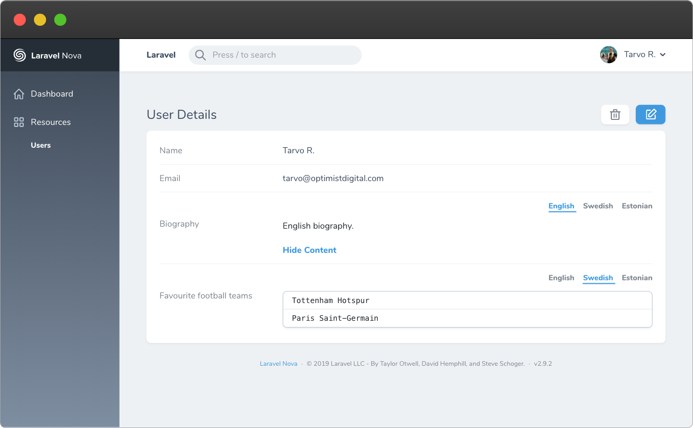
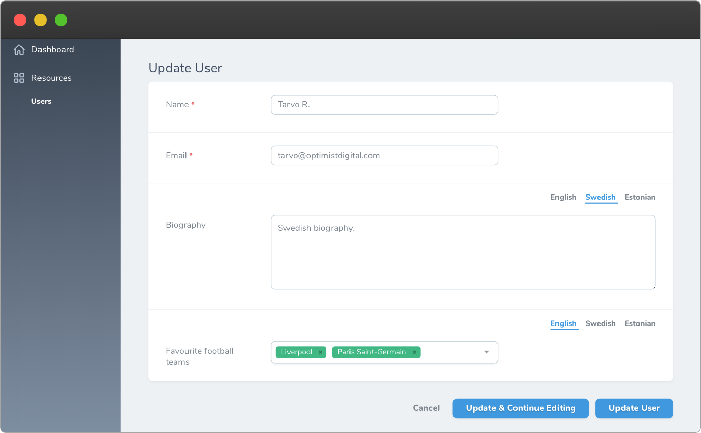
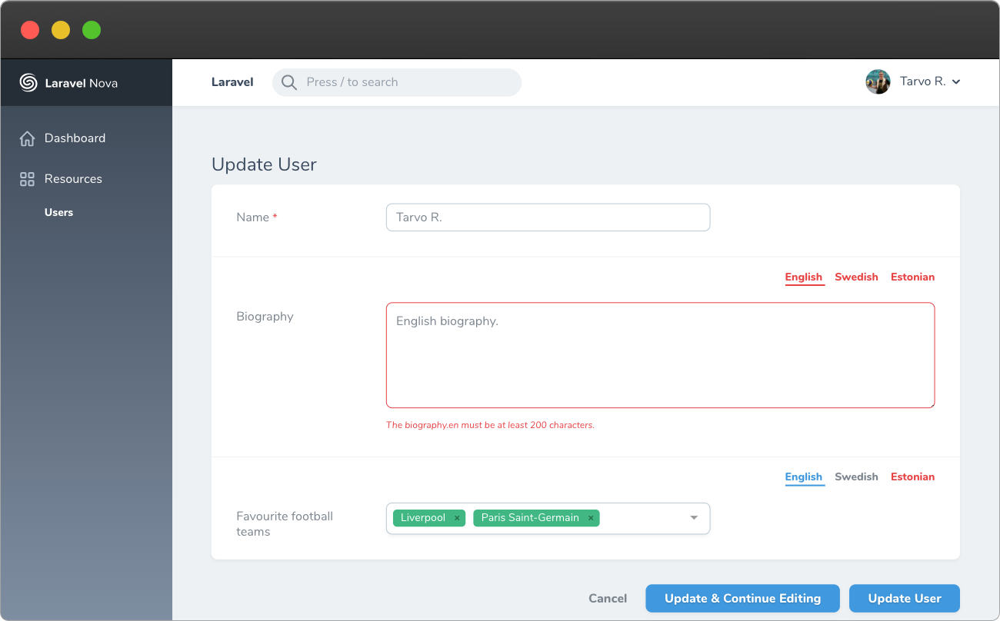

# Nova Translatable

[](https://packagist.org/packages/optimistdigital/nova-translatable)
[](https://packagist.org/packages/optimistdigital/nova-translatable)

This [Laravel Nova](https://nova.laravel.com) allows you to make any input field `spatie/laravel-translatable` compatible and localisable.

## Requirements

- `laravel/nova: ^2.9 || ^3.0`
- `spatie/laravel-translatable: ^4.0`

## Features

- **Supports almost all fields** (including third party ones)
- **Supports default validation automatically**
- **Simple to implement** with minimal code changes (after `spatie/laravel-translatable` support)
- Locale tabs to switch between different locale values of the same field
- **Double click** on a tab to switch all fields to that locale
- Supports [nova-settings](https://github.com/optimistdigital/nova-settings) package

## Known non-working fields

- `Image` and `File`
  - Workarounds:
    - [optimistdigital/nova-media-field](https://github.com/optimistdigital/nova-media-field)
    - [ebess/advanced-nova-media-library](https://github.com/ebess/advanced-nova-media-library)
    - Or any library that uploads images/files using XHR

## Limitations

- The following methods can not be used, as this package uses them internally:
  - `resolveUsing`
  - `fillUsing`
  - `displayUsing` (might be fixed eventually)

## Screenshots







## Installation

Firstly, set up [spatie/laravel-translatable](https://github.com/spatie/laravel-translatable).

Install the package in a Laravel Nova project via Composer:

```bash
# Install nova-translatable
composer require optimistdigital/nova-translatable

# Publish configuration (optional, but useful for setting default locales)
php artisan vendor:publish --tag="nova-translatable-config"
```

## Usage

Call `->translatable()` on any field, like so:

```php
// Any Nova field
Text::make('Name')
  ->rules('required', 'min:2')
  ->translatable(),

// Any third-party input field
Multiselect::make('Football teams')
  ->rules('required')
  ->translatable(),

// Optionally pass custom locales on a per-field basis
Number::make('Population')
  ->translatable([
    'en' => 'English',
    'et' => 'Estonian',
  ]),
```

## Validation

It's possible to define locale specific validation rules.

To do so, add the `->rulesFor()` on your field and the `HandlesTranslatable` trait to your Nova resource.

`->rulesFor` accepts `array|string|callable` locales and `array|callable` rules.

```php
use OptimistDigital\NovaTranslatable\HandlesTranslatable;

class Product extends Resource
{
    use HandlesTranslatable;

    public function fields(Request $request)
    {
        return [
            Text::make(__('Name'), 'name')
                ->sortable()
                ->translatable()
                ->rules(['max:255'])
                ->rulesFor('en', [
                    'required',
                ])
                ->rulesFor(['en', 'et'], function ($locale) {
                    return ["unique:products,name->$locale{{resourceId}}"];
                }),
        ];
    }
}
```
#### In this example, rules will be added to the following values
```dotenv
max: name.*
required: name.en
unique: name.en & name.et
```

## Configuration

You can define default locales for all the `translatable` fields in the config file. The config file can be published using:

```bash
php artisan vendor:publish --tag="nova-translatable-config"
```

## Credits

- [Tarvo Reinpalu](https://github.com/Tarpsvo)

## License

This project is open-sourced software licensed under the [MIT license](LICENSE.md).
